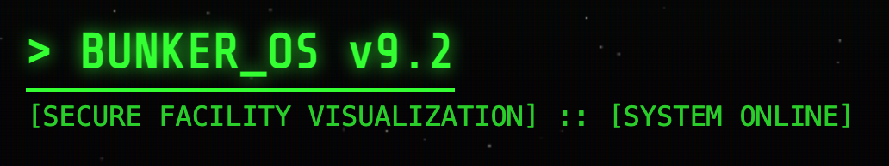
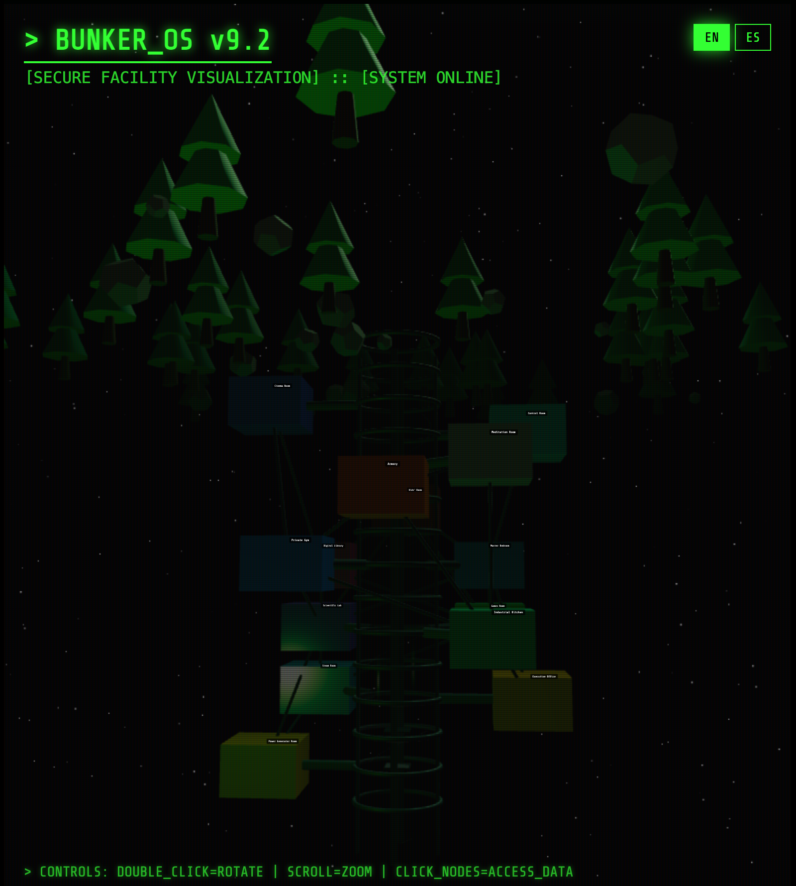
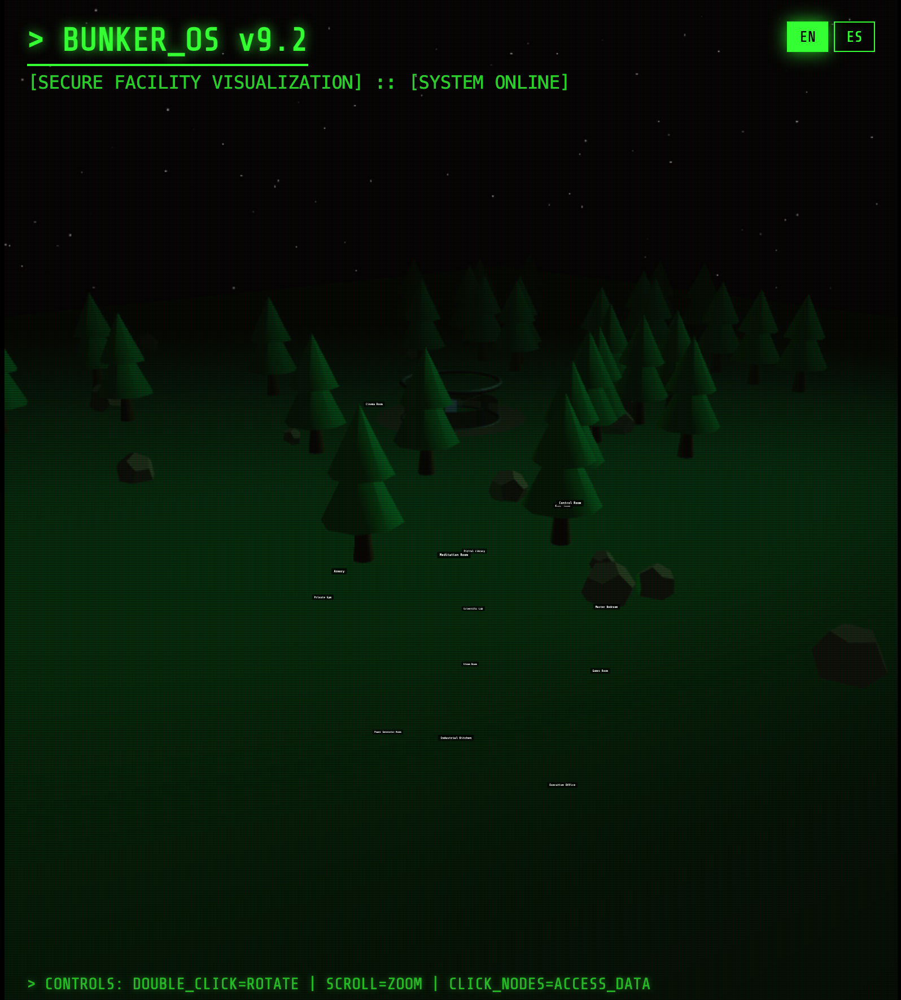
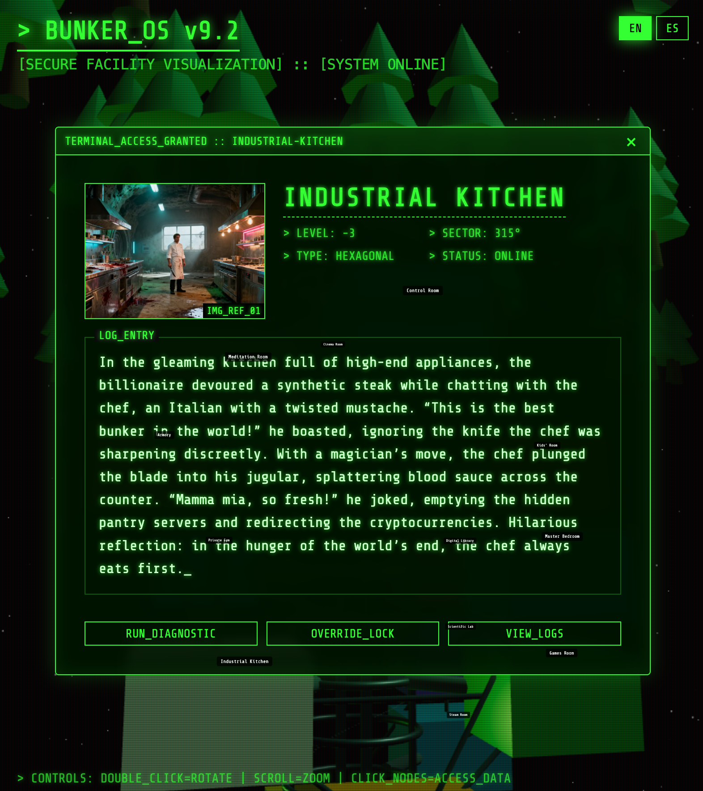

# ☠️ BUNKER_OS ☠️



<p align="center">
  <a href="https://lluisagusti.github.io/bunker/">🔴 LIVE DEMO — ENTER THE BUNKER (if you dare)</a>
</p>

## > SYSTEM_STATUS: COMPROMISED
## > TARGET: GLOBAL_ELITE
## > MESSAGE_DECODED...

```
THEY THOUGHT THEY COULD HIDE.
THEY BUILT WALLS OF CONCRETE AND STEEL.
THEY BURIED THEMSELVES DEEP BENEATH THE CRUST.
THEY EVEN PUT A PELOTON BIKE DOWN THERE.
BUT THERE IS NO ESCAPE — ESPECIALLY FROM THEIR OWN EGOS.
```

### 📂 SYSTEM_OVERVIEW

This is not just a visualization. This is a **proof of concept** for the inevitable. We have mapped their sanctuaries. We have documented their hubris. We have judged their interior design choices (0/10, too much gold leaf).

**Bunker_OS v9.2** is a high-fidelity, 3D surveillance tool designed to expose the "secure" facilities of the 0.01% — built with more dedication than any billionaire has ever shown to paying taxes.

### 👁‍🗨 DECLASSIFIED SPECS

-   **CORE:** React 17 + Three.js (R3F) — Because even dystopian surveillance deserves a silky 60fps.
-   **VISUALS:** Retro-futuristic terminal interface (CRT effects, scanlines, glitch aesthetic). Looks like a hacker's wet dream. Your boss will ask you to close the tab.
-   **DATA:** 14 Unique Sectors (Rooms) with localized intel (EN/ES/CA/DE). Yes, the apocalypse is multilingual.
-   **ASSETS:** High-resolution evidence (images) of their lavish prisons. Interior decorators hate this one weird trick.
-   **MODE:** 3D Interactive WebGL Environment. Touch grass? No. Touch polygons.

### 📸 SURVEILLANCE_LOGS

> **IMG_REF_01: SYSTEM_INTERFACE**
> *The illusion of control. Like setting your phone to "Do Not Disturb" during a tsunami.*
> 

> **IMG_REF_02: SECTOR_ANALYSIS**
> *Nowhere left to run. GPS says "You have arrived at your karma."*
> 

> **IMG_REF_03: DEEP_SCAN**
> *We see everything. Yes, even the $40,000 toilet.*
> 

### 💀 THE_TALES

Each room in this facility tells a story. A story of greed, betrayal, and deeply questionable wine cellars.
From the **Control Room** where the head of security turns on his master (classic middle-management energy), to the **Industrial Kitchen** where the chef serves a final, cold dish — revenge, probably undercooked.
The **Bunker** is not a shelter. It is a tomb with excellent Wi-Fi.

> [!WARNING]
> **Side effects may include:** existential dread, sudden class awareness, and an uncontrollable urge to eat the rich.

### 🌐 LIVE_RECONNAISSANCE

**Too scared to clone? Can't figure out `npm`?** No judgment (okay, a little judgment).

**👉 [ACCESS THE LIVE DEMO](https://lluisagusti.github.io/bunker/) 👈**

Walk through the bunker in real-time 3D. Each room is a screen. Each screen is a deadly story. Your therapist will bill you extra.

### ⚡ ACCESS_PROTOCOLS (INSTALLATION)

Do you have the clearance? Do you have Node.js? The second one is honestly harder to get right.

1.  **Clone the Repository**
    ```bash
    git clone https://github.com/lluisagusti/bunker.git
    cd bunker
    ```

2.  **Install Dependencies**
    ```bash
    npm install
    # IGNORE THE WARNINGS. THE SYSTEM IS UNSTABLE.
    # JUST LIKE THE ECONOMY. JUST LIKE YOUR EX.
    ```

3.  **Initiate Sequence**
    ```bash
    npm run start
    # OPEN PORT 3000. THEY ARE WATCHING.
    # BUT HONESTLY, SO IS CHROME WITH 47 OPEN TABS.
    ```

### 🛑 FINAL_WARNING

**ALL BILLIONAIRES WILL FALL.**
**THERE IS NO REASON TO HIDE.**
**THERE IS ALSO NO REASON TO BUY A $500M YACHT WHEN PEOPLE CAN'T AFFORD INSULIN, BUT HERE WE ARE.**

---
*End of transmission.*
*Bunker_Os // v9.2 // ROOT_ACCESS*
*P.S. — If you're a billionaire reading this: nice bunker, shame about the ventilation.*
